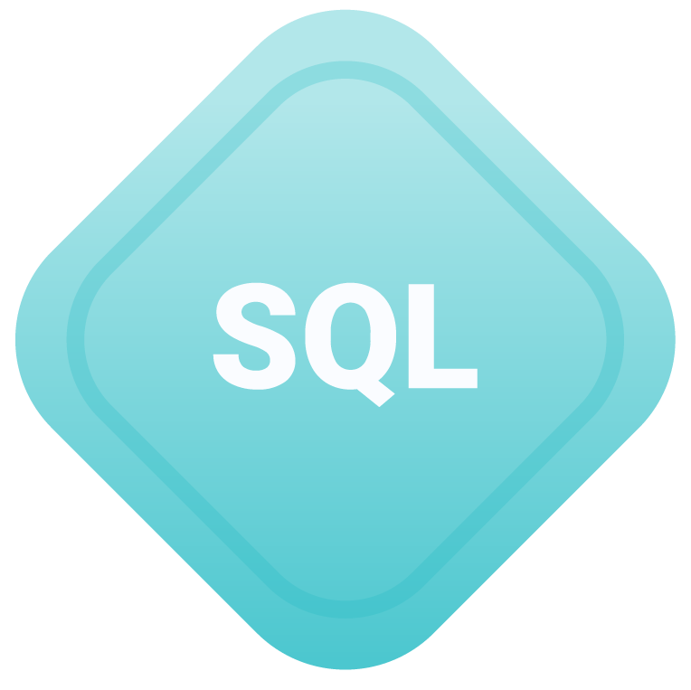

## Star_Code_Projects  👨🏽‍💻
Welcome to Star Code Projects (مهام منصة سطر). Here are the projects I made in [Satr.codes](https://profile.satr.codes/buashraf/public/overview) courses.


## License

[](./LICENSE)

## 🏅 Badges

<table>
  <tr>
    <td align="center">
      <br/>
       Python 101  إتمام 🏁
    </td>
    <td align="center">
      <br/>
      GitHub  وسام 🥇
    </td>
    <td align="center">
      <br/>
       SQL 101  إتمام 🏁
    </td>
    <td align="center">
      <br/>
       SQL 102  إتمام 🏁
    </td>
  </tr>
</table>

</div>


<hr>
<hr>

# Project_Python_101  👨🏽‍💻
📞 Phone Book

 - This is the task on Course Python 101 on star.code.


- Here is the capture of the code.


- Here is the capture of the terminal.


- This is the is the certificate you will get after you finish the course. 


## 🛢️ Project_SQL_101  
### 📚 Tamayoz School Database  

This project was completed as part of the **SQL 101** course on [Satr.codes](https://satr.codes), where I built a structured database for a school named **Tamayoz School**.

### 🔍 Key Highlights:
- Created 3 main tables: `students`, `teachers`, and `subjects`
- Inserted realistic mock data:
  - 30 student records
  - 10 teacher records
  - 6 subject entries
- Demonstrated SQL queries such as `SELECT`, `ORDER BY`, `UPDATE`, and `RENAME TABLE`
- Covered important SQL concepts:
  - ✅ Data types & constraints
  - ✅ Aliasing
  - ✅ Table relationships
  - ✅ Basic data manipulation

### 💻 Example Queries:

```sql
-- Display all students ordered by name
SELECT * FROM students ORDER BY Student_name ASC;

-- Update student email
UPDATE students SET Student_email = 'updated_email@tamayoz.edu' WHERE id = 1;

-- Rename teachers table to instructors
RENAME TABLE teachers TO instructors
```

- This is the is the certificate you will get after you finish the course. 

## 🛢️ Project_SQL_102  
### 📚 Tamayoz School Database – Advanced SQL  

This project was completed as part of the **SQL 102** course on [Satr.codes](https://satr.codes), where I built on the original schema with advanced queries, functions, and data transformations.

### 🔍 Key Highlights:
- **Derived Tables:**  
  - `top_students` (GPA > 90)  
  - `failing_students` (GPA < 60)  
- **Filtering & Search:**  
  - Names starting with `A` (LIKE)  
  - Names of length 4 (CHAR_LENGTH)  
- **Aggregate Analytics:**  
  - `AVG`, `MAX`, `MIN` on GPA  
- **Special Cases:**  
  - Level 6 students with GPA = 100  
  - Level 1 students aged 15–16 (TIMESTAMPDIFF)  
  - Count of level 2 students  
- **Distinct & Formatting:**  
  - `DISTINCT Major`  
  - `UPPER(Subject_name)`  
- **Functions & Updates:**  
  - `FLOOR(AVG(GPA))`  
  - `REPLACE` to map `M`→`Male`, `F`→`Female`  
  - Increase GPA by 5 for all GPA < 60  

### 💻 Example Queries:

```sql
-- 1. Create derived tables
CREATE TABLE top_students     AS SELECT * FROM students WHERE GPA > 90;
CREATE TABLE failing_students AS SELECT * FROM students WHERE GPA < 60;

-- 2. Search & filter
SELECT Student_name
FROM students
WHERE Student_name LIKE 'A%';

SELECT Student_name
FROM students
WHERE CHAR_LENGTH(Student_name) = 4;

-- 3. Aggregate functions
SELECT 
  AVG(GPA) AS average_gpa, 
  MAX(GPA) AS highest_gpa, 
  MIN(GPA) AS lowest_gpa
FROM students;

-- 4. Special-case queries
SELECT Student_name
FROM students
WHERE Academic_level = 6
  AND GPA = 100;

SELECT *
FROM students
WHERE Academic_level = 1
  AND TIMESTAMPDIFF(YEAR, Student_dob, CURDATE()) BETWEEN 15 AND 16;

SELECT COUNT(*) AS level_2_count
FROM students
WHERE Academic_level = 2;

-- 5. Distinct & uppercase
SELECT DISTINCT Major
FROM students;

SELECT UPPER(Subject_name) AS Subject_name
FROM subjects;

-- 6. Numeric & string updates
SELECT FLOOR(AVG(GPA)) AS floored_avg_gpa
FROM students;

UPDATE students
SET Gender = REPLACE(REPLACE(Gender, 'M', 'Male'), 'F', 'Female');

UPDATE students
SET GPA = GPA + 5
WHERE GPA < 60;
```

- This is the is the certificate you will get after you finish the course. 


## Get to Know Me  😁

- 🌐 **Website:**  I will add it in the future 😅
  
- 🌐 **Star.Code:** [See my Profile](https://profile.satr.codes/buashraf/public/overview)

- 💼 **LinkedIn:** [Connect with me](www.linkedin.com/in/muhammed-alkulaib-773492238)

- ✖ **Twitter:** [Follow me](https://twitter.com/bo_ashraf)

- 📬 **Email:** [Connect with me](muhammedalmugera21@gmail.com)
